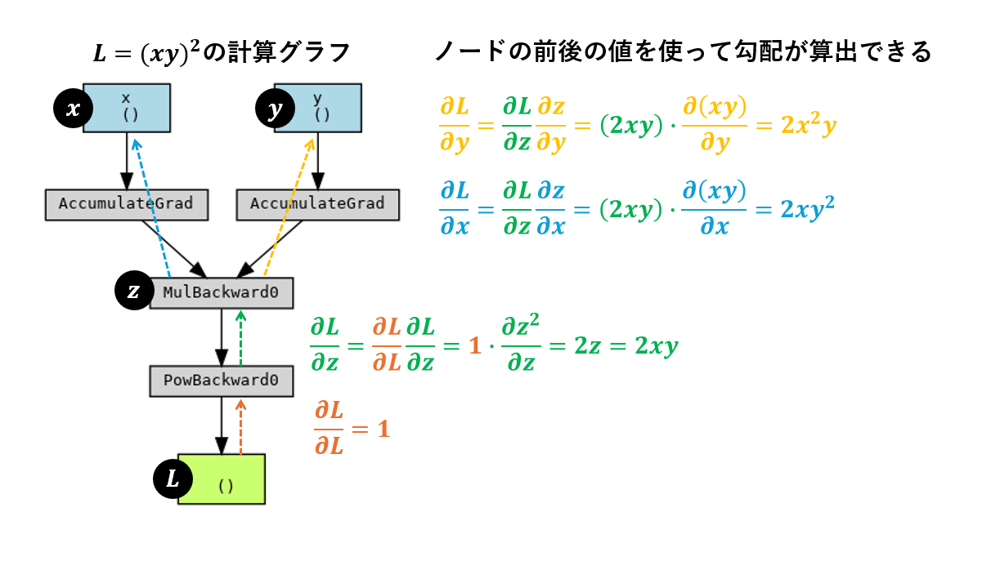

# Pytrochの自動微分を勉強するためのリポジトリ

## 環境構築
pytorchおよびgraphvizをインストールしたコンテナをビルドする。
```
# dockerイメージのビルドとバックグラウンドでのコンテナの起動
$ docker compose up -d
```

## 自動微分および計算グラフの可視化サンプル
$L = (xy)^2$ の自動微分を計算する。
```
# コンテナに入る
$ docker exec -it pytorch-dev-environment-container bash

# コンテナ内で自動微分のサンプルを実行
# 参考文献2でp30の図2.12を再現
$ python auto_grad_sample.py
```


## 自動微分と計算グラフ
- 自動微分(automatic differentiation)とは、ある関数 $y=f(x)$ を計算する手順をもとに、この関数の微分 $dy/dx$ を計算する手順を自動生成する方法である。
- pytorchでは、計算グラフを用いて自動微分を実現している。
- 計算グラフを用いることで、バックプロパゲーションの計算をチェインルールによって効率的に計算できる。
    - 局所的な計算を組み合わせて全体的な計算を行うことができる。
    - 実装面においても、ニューラルネットワークの全体的な勾配計算に気を配ることなく、各局所的な簡易な演算の勾配にのみ気を配ればよくなる。

## 例
- $ L = (xy)^2 $ の自動微分を計算する。
- 下図において、$x$ と $y$ は入力変数であり、$L$ は出力変数である。
- この計算グラフを用いて、$L$ の微分 $dL/dx$ と $dL/dy$ を計算する。
- 下図の下部から上部への計算を行うことで、$L$ の微分 $dL/dx$ と $dL/dy$ を簡易な局所的な計算によって計算できていることがわかる。



## 参考文献
- 1. 岡谷貴之.「深層学習」(機械学習プロフェッショナルシリーズ). 講談社, 2022.
- 2. 菅沼雅徳.「深層学習による画像認識の基礎」. オーム社, 2024. 
